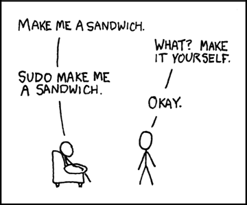

---
# You can uncomment this to create your own theme.
# theme:
#   light:
#     root: bg-white
#     h1: text-blue-600 font-bold
#     h2: text-blue-500
#     blockquote: text-gray-500 font-italic
#     code:
#       block: bg-gray-100
#       inline: bg-gray-100 text-rose-600
#       syntax:
#         keyword: text-purple-600 font-bold
#         string: text-green-700
#         comment: text-gray-400 font-italic
#         function: text-blue-600
#   dark:
#     root: bg-slate-900
#     h1: text-sky-400 font-bold
#     h2: text-sky-300
#     blockquote: text-slate-400 font-italic
#     code:
#       block: bg-slate-800
#       inline: bg-slate-800 text-orange-400
#       syntax:
#         keyword: text-violet-400 font-bold
#         string: text-green-400
#         comment: text-slate-500 font-italic
#         function: text-sky-400
---

# md-slides

Present from your terminal, write in markdown.

---

## How it works

Your presentation is a single markdown file. Separate slides with `---` on its own line.

```markdown
# Slide 1

Some content

---

# Slide 2

More content
```

---

## Text formatting

Markdown formatting works as you'd expect.

You can write **bold**, _italic_, and ~~strikethrough~~ text. Use `inline code` for technical terms.

---

## Lists

Unordered lists with nesting:

- Markdown features
  - Text formatting
  - Code blocks
  - Tables
- Theming via frontmatter
- Light and dark mode

Ordered lists:

1. Write your slides
2. Run `md-slides slides.md`
3. Present

---

## Code blocks

Fenced code blocks support syntax highlighting for 30+ languages.

```go
package main

import "fmt"

func main() {
	// present from your terminal
	fmt.Println("Hello, audience!")
}
```

---

## Blockquotes

> Simplicity is the ultimate sophistication.

> Blockquotes work across
>
> multiple paragraphs.

---

## Links

Inline links: [md-slides on GitHub](https://github.com/FalkZ/md-slides)

Autolinks: <https://github.com>

---

## Tables

| Feature      | Supported |
| ------------ | --------- |
| Bold, italic | yes       |
| Code blocks  | yes       |
| Tables       | yes       |
| Images       | yes       |
| Theming      | yes       |

---

## Images

Standard image:


_Image from: <https://xkcd.com/149/>_

---

## Images with custom height

Control the height in terminal rows with `| N` in the alt text:

```markdown

```



_Image from: <https://xkcd.com/149/>_

If an image can't load, the alt text is shown instead:


---

## Theming

Style your slides with a YAML frontmatter block and Tailwind classes:

```yaml
---
theme:
  light:
    h1: text-blue-600 font-bold
    code:
      syntax:
        keyword: text-purple-600
  dark:
    h1: text-sky-400 font-bold
---
```

Press `t` to toggle between light and dark mode.

---

## Keyboard controls

| Key                   | Action         |
| --------------------- | -------------- |
| Right / l / n / Space | Next slide     |
| Left / h / p          | Previous slide |
| g / Home              | First slide    |
| G / End               | Last slide     |
| t                     | Toggle theme   |
| q / Ctrl+c            | Quit           |

---

## Theme inheritance

Use `extends` to inherit from a base theme (URL or local path):

```yaml
---
theme:
  extends: https://example.com/theme.yaml
  light:
    h1: text-red-600
---
```

Merge order: default → extended → local overrides.

---

# Go present something.
